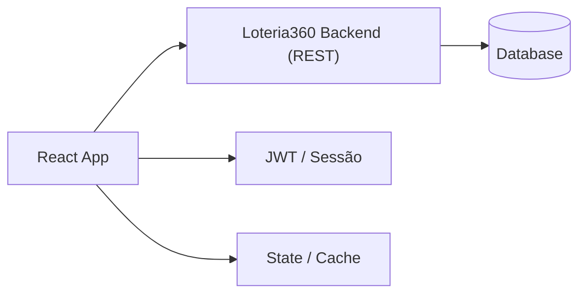

# loterica360-frontend — Frontend (React)

Aplicação React para o **Loteria360**, com páginas de **dashboard**, **jogos**, **bolões**, **vendas**, **caixas** e **relatórios**. Este README consolida **tecnologias**, **estrutura**, **rotas**, **integrações** e **como executar**.

> Versão do app: `0.0.0`

---

## Sumário
- [Visão Geral](#-visão-geral)
- [Principais Funcionalidades](#-principais-funcionalidades)
- [Stack Tecnológico](#-stack-tecnológico)
- [Estrutura do Projeto](#-estrutura-do-projeto)
- [Roteamento & Navegação](#-roteamento--navegação)
- [Integração com Backend](#-integração-com-backend)
- [Regras de Negócio na UI](#-regras-de-negócio-na-ui)
- [Variáveis de Ambiente](#-variáveis-de-ambiente)
- [Scripts NPM](#-scripts-npm)
- [Execução & Build](#-execução--build)
- [Qualidade, A11y & Segurança](#-qualidade-a11y--segurança)
- [Performance](#-performance)
- [Docker & Deploy](#-docker--deploy)
- [Roadmap](#-roadmap)
- [Licença](#-licença)

---

## Visão Geral

Frontend que consome a API do **Loteria360 Backend**, provendo telas para operação de **casas lotéricas** (cadastros, lançamentos e analytics).

Arquitetura de alto nível:


---

## Principais Funcionalidades
- **Autenticação** (login/logout) e rotas protegidas.
- **Dashboard** com métricas e gráficos.
- **Jogos**: criar/editar/ativar.
- **Bolões**: criação, status e **cotas**.
- **Vendas**: lançamento com método de pagamento.
- **Caixa**: abertura/fechamento e **contagem**.
- **Clientes**: busca/cadastro e vínculo com vendas.
- **Relatórios** com filtros por período.

---

## Stack Tecnológico
- **Framework:** React ^18.2.0 (TypeScript)
- **Bundler:** Vite
- **Roteamento:** react-router-dom
- **Estado:** @reduxjs/toolkit, react-redux
- **Data fetching:** @tanstack/react-query, axios
- **UI/Design:** tailwindcss, recharts
- **Estilos:** Tailwind CSS
- **Gráficos:** Recharts/Chart.js
- **Lint/Format:** eslint, prettier

---

## Estrutura do Projeto
```
src/
├─ assets/
├─ components/
│  ├─ dashboard/
│  │  ├─ MetricCard.tsx
│  │  ├─ MonthlyComparison.tsx
│  │  ├─ PeriodFilter.tsx
│  │  ├─ RecentActivity.tsx
│  │  ├─ SimpleChart.tsx
│  │  ├─ TrendAnalysis.tsx
│  │  └─ YearlyComparison.tsx
│  ├─ forms/
│  │  ├─ BolaoForm.tsx
│  │  ├─ ChangePasswordModal.tsx
│  │  ├─ ClienteForm.tsx
│  │  ├─ ContagemCaixaForm.tsx
│  │  ├─ DeleteUserModal.tsx
│  │  ├─ JogoForm.tsx
│  │  ├─ UserForm.tsx
│  │  └─ VendaCaixaForm.tsx
│  ├─ layout/
│  │  ├─ AuthRoute.tsx
│  │  ├─ Breadcrumb.tsx
│  │  ├─ CollapsedMenuIcon.tsx
│  │  ├─ Header.tsx
│  │  ├─ Layout.tsx
│  │  ├─ MenuIndicator.tsx
│  │  ├─ MenuSection.tsx
│  │  ├─ PermissionRoute.tsx
│  │  ├─ Sidebar.tsx
│  │  ├─ Submenu.tsx
│  │  └─ VendedorRedirect.tsx
│  ├─ ui/
│  │  ├─ Button.tsx
│  │  ├─ Card.tsx
│  │  ├─ ErrorMessage.tsx
│  │  ├─ Input.tsx
│  │  ├─ Label.tsx
│  │  ├─ Modal.tsx
│  │  ├─ Select.tsx
│  │  ├─ Table.tsx
│  │  └─ Textarea.tsx
│  ├─ Dashboard.tsx
│  └─ NovaVenda.tsx
├─ docs/
│  ├─ ACCORDION_BEHAVIOR.md
│  ├─ ACCORDION_DEMO.md
│  ├─ CROSS_MENU_NAVIGATION.md
│  ├─ MENU_COLLAPSE_EXAMPLE.md
│  ├─ MENU_COLLAPSE_FEATURES.md
│  ├─ MENU_SYSTEM.md
│  ├─ MENU_VISUAL_COMPARISON.md
│  ├─ MENU_VISUAL_EXAMPLE.md
│  └─ NEW_MENU_STRUCTURE.md
├─ hooks/
│  ├─ useApi.ts
│  ├─ useAuth.tsx
│  ├─ useErrorHandler.tsx
│  ├─ useLocalStorage.ts
│  ├─ useMenuState.ts
│  └─ usePermissions.tsx
├─ pages/
│  ├─ AnalysisPage.tsx
│  ├─ BoloesPage.tsx
│  ├─ ClientesPage.tsx
│  ├─ DashboardPage.tsx
│  ├─ JogosPage.tsx
│  ├─ LoginPage.tsx
│  ├─ MovimentosPage.tsx
│  ├─ RelatoriosPage.tsx
│  ├─ TurnosPage.tsx
│  ├─ UsuariosPage.tsx
│  └─ VendasPage.tsx
├─ services/
│  ├─ api.ts
│  ├─ authService.ts
│  ├─ bolaoService.ts
│  ├─ caixaService.ts
│  ├─ clienteService.ts
│  ├─ contagemCaixaService.ts
│  ├─ dashboardService.ts
│  ├─ jogoService.ts
│  ├─ movimentoService.ts
│  ├─ relatorioService.ts
│  ├─ turnoService.ts
│  ├─ userService.ts
│  └─ vendaCaixaService.ts
├─ store/
│  ├─ slices/
│  │  ├─ authSlice.ts
│  │  └─ uiSlice.ts
│  └─ index.ts
├─ styles/
│  └─ globals.css
├─ types/
│  ├─ index.ts
│  └─ menu.ts
├─ utils/
│  ├─ cn.ts
│  └─ format.ts
├─ App.tsx
└─ main.tsx
```

**Diretórios comuns:**
- `components/` – UI compartilhada (cards, tabelas, inputs).
- `pages|screens|views/` – telas roteadas.
- `routes/` – configuração do roteamento.
- `services/` ou `api/` – cliente HTTP (`axios`/`fetch`) e endpoints.
- `store/` – estado global (Redux/Zustand/Context).
- `hooks/` – lógica reutilizável.
- `assets/` – imagens/ícones.
- `styles/` – estilos globais/Tailwind.

---

## Roteamento & Navegação

Biblioteca(s): react-router-dom

**Rotas detectadas (heurística):**
- `/`
- `/*`
- `/analise`
- `/boloes`
- `/clientes`
- `/jogos`
- `/login`
- `/movimentos`
- `/relatorios`
- `/turnos`
- `/usuarios`
- `/vendas`

Sitemap de referência:
```
/                    # Dashboard
/login               # Autenticação
/jogos               # Listagem/Cadastro
/boloes              # Gestão de bolões
/vendas              # Lançamentos
/caixas              # Abertura/Fechamento
/clientes            # Clientes
/relatorios          # Relatórios
```

---

## Integração com Backend

- **HTTP Client**: axios
- **Base URLs estáticas encontradas:** _não detectadas_

Recomendado:
- Interceptors para anexar JWT e tratar 401/403 (logout/refresh).
- Serviços isolados em `services/` (SRP) e hooks (`useAuth`, `useApi`, `useBolao`...).
- DTOs tipados (TypeScript) ou schemas (Zod/Yup) para validação.

---

## Regras de Negócio na UI
- **Bolões**: bloquear venda quando as **cotas disponíveis** chegarem a zero ou status não for `ABERTO`.
- **Vendas**: validar total e método de pagamento antes de confirmar.
- **Caixa**: permitir **fechamento** apenas se não houver lançamentos pendentes.
- **Jogos**: listar **ativos** por padrão; permitir filtro de status.
- **Perfis**: esconder/disable de botões conforme `role` do usuário.

> A UI deve refletir as mesmas regras do backend para evitar inconsistências.

---

## Variáveis de Ambiente

Crie um `.env` na raiz do projeto com, por exemplo:

```env
VITE_API_BASE_URL=http://localhost:8080
```

> Em **Vite**, variáveis expostas ao cliente **precisam** começar com `VITE_`.

---

## Scripts NPM

```bash
dev          -> vite
build        -> tsc && vite build
lint         -> eslint . --ext ts,tsx --report-unused-disable-directives --max-warnings 0
preview      -> vite preview
test         -> jest
test:watch   -> jest --watch
format       -> prettier --write .
prepare      -> husky install
```

Porta de desenvolvimento padrão: `5173`.

---

## Execução & Build

```bash
# Instalar
npm install

# Dev
npm run dev

# Build produção
npm run build

# Preview (quando existir)
npm run preview
```

---

## Qualidade, A11y & Segurança
- **ESLint/Prettier**: sim / sim.
- **Acessibilidade**: semântica, foco visível, labels, navegação por teclado.
- **Segurança**: sem segredos no código; HTTPS; sanitização de HTML; expiração de sessão.

---

## Performance
- `React.lazy` para rotas pesadas, memoização de componentes.
- Cache de chamadas e revalidação quando usar React Query/SWR.
- Imagens otimizadas e lazy loading.

---

## Docker & Deploy

Exemplo (Vite + Nginx):

```dockerfile
FROM node:20-alpine AS build
WORKDIR /app
COPY package*.json ./
RUN npm ci
COPY . .
RUN npm run build

FROM nginx:alpine
COPY --from=build /app/dist /usr/share/nginx/html
EXPOSE 80
CMD ["nginx","-g","daemon off;"]
```

---

## Roadmap
- Testes (Vitest/Jest + RTL).
- Observabilidade (Web Vitals, Sentry).
- Design System/tema e docs de UI.
- Telemetria de erros e métricas de UX.

---

## Licença
Defina a licença (ex.: MIT).
